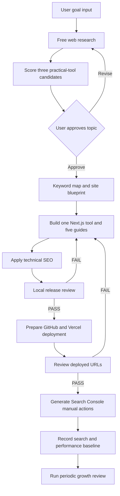

# SEO Experiment Harness Design

## 1. Purpose

Build a repository-local Codex harness for creating and operating a small
Next.js SEO experiment site. The initial site should test whether Google can
discover and expose a useful Korean-language project for long-tail queries.
The project must also be structured so that English pages can be added later.

The harness is inspired by the staged production pattern in
`revfactory/harness-100/ko/01-youtube-production/.claude`: domain-specific
roles, an orchestrating skill, file-based artifacts, explicit handoffs, and a
final review step. It adapts that pattern for Codex by using repository-local
instructions and sequential role checklists instead of relying on Claude-only
agent messaging.

## 2. Confirmed Scope

The harness covers the complete lifecycle:

1. Research practical tool-and-guide topics using free web-accessible data.
2. Present three scored topic candidates and wait for user approval.
3. Design a Korean-first keyword map and a site structure that can add English
   pages later.
4. Build a Next.js App Router site with one useful tool and five supporting
   guide pages.
5. Apply technical SEO requirements during development.
6. Run local and deployed-URL release reviews.
7. Prepare GitHub and Vercel deployment steps.
8. Generate the manual Google Search Console action list.
9. Record a baseline and review improvements using Google Search Console and
   Vercel Analytics.

The first release does not depend on paid SEO tools, GA4, bulk-generated
content, or automatic Search Console access.

## 3. Repository Structure

```text
AGENTS.md
.codex/
  skills/
    seo-site-production/
      SKILL.md
    topic-discovery/
      SKILL.md
    technical-seo/
      SKILL.md
    seo-release-review/
      SKILL.md
    seo-growth-review/
      SKILL.md
  roles/
    topic-researcher.md
    site-architect.md
    nextjs-builder.md
    technical-seo-reviewer.md
    growth-analyst.md
_workspace/
  README.md
  templates/
docs/
  seo-experiment/
    README.md
```

`AGENTS.md` defines project-wide instructions. The `seo-site-production`
skill orchestrates the workflow and approval gates. Focused skills contain
repeatable procedures. Role files describe the perspective and deliverables
for each stage. `_workspace/` stores generated research and review artifacts.

## 4. Workflow



The harness must never begin implementation before the user approves a
topic candidate. GitHub, Vercel, and Search Console operations that require
authentication stop at a clearly described user action when credentials are
not available.

## 5. Topic Research

The topic must fit the practical-tool-plus-guides format. The researcher uses
web search actively but relies only on free-accessible sources such as search
results, related query signals, official sources, and Google Trends where
useful. Each report distinguishes verified facts from estimates and records
research URLs and the research date.

Each candidate is scored out of 100:

| Criterion | Weight |
| --- | ---: |
| Clear long-tail search intent | 25 |
| Search-result competition level | 20 |
| Opportunity to differentiate | 20 |
| Ability to support five useful guides | 15 |
| Verifiable with free data | 10 |
| Maintenance cost | 10 |

The top candidate is a recommendation, not an automatic decision.

## 6. Roles

| Role | Responsibility | Primary artifacts |
| --- | --- | --- |
| `topic-researcher` | Research queries, competing pages, and three scored candidates | `01_topic_candidates.md` |
| `site-architect` | Design search intent, Korean-first keyword map, English expansion structure, one tool, and five guides | `03_keyword_map.md`, `04_site_blueprint.md` |
| `nextjs-builder` | Implement the App Router site, prefer Server Components for indexable content, configure Vercel Analytics | Application code |
| `technical-seo` | Apply metadata, canonical, sitemap, robots, JSON-LD, internal-link, and future hreflang requirements | Application code |
| `seo-release-review` | Review local and production behavior against repository rules and current official documentation | `05_release_review.md`, `05_release_review.json` |
| `growth-analyst` | Analyze Search Console and Vercel Analytics results and recommend improvements | `07_growth_baseline.md`, `08_growth_review.md` |

## 7. Workspace Artifacts

```text
_workspace/
  00_input.md
  01_topic_candidates.md
  02_approved_topic.md
  03_keyword_map.md
  04_site_blueprint.md
  05_release_review.md
  05_release_review.json
  06_manual_actions.md
  07_growth_baseline.md
  08_growth_review.md
```

Templates should be included so that reports remain comparable across runs.

## 8. Technical SEO Implementation Rules

The development checklist is based on Next.js App Router behavior and Google
Search guidance:

- Define indexable public URLs before implementation.
- Keep important content in initial HTML. Use client components only for
  interaction that requires the browser.
- Provide a unique title, description, canonical URL, and one representative
  `h1` for every indexable page.
- Use meaningful heading order, crawlable internal links, and descriptive
  anchor text.
- Use readable slugs and return proper `404` responses for missing dynamic
  routes.
- Choose SSG, ISR, or SSR based on content freshness. Do not use SSR solely
  as an SEO ritual.
- Provide production-aware `robots.ts` and `sitemap.ts`.
- Add structured data only when it matches visible page content and the page
  type.
- Add meaningful image alt text, compressed images, explicit dimensions, and
  OG images where appropriate.
- Set the Korean language correctly and leave a clear route-level design for
  future English pages, localized canonicals, and `hreflang`.
- Prevent preview deployments and private pages from becoming indexable.
- Include favicon, HTTPS, redirect, and error-response checks.
- Add Vercel Analytics for the agreed initial measurement layer.

## 9. Release Review

The release reviewer runs both a stable repository checklist and a
current-documentation review. Official sources take priority over blogs or
third-party summaries. Each report records the review date, checked URLs, and
official references. If official guidance has changed, the reviewer proposes
updates to the project instructions.

The reviewer uses four statuses:

| Status | Meaning |
| --- | --- |
| `PASS` | Requirement satisfied |
| `WARN` | Deployment is possible, but improvement is recommended |
| `FAIL` | Do not report deployment as complete |
| `MANUAL` | User or authenticated external-service action is required |

Release-blocking failures include:

- An expected public URL does not return `200 OK`.
- `robots.txt` or `sitemap.xml` is unavailable.
- A production URL is accidentally marked `noindex`.
- A canonical URL is missing or points to the wrong domain.
- Important content is absent from initial HTML.
- A page-specific title, description, or `h1` is missing.
- An internal link is broken or uncrawlable.
- Structured data contradicts visible content.
- Korean pages have an incorrect language setting.

Performance results are recorded as a baseline. Core Web Vitals or PageSpeed
issues are normally warnings, but the reviewer may escalate severe usability
failures.

## 10. Official Documentation Baseline

The reviewer re-checks these official sources when running a release review:

- [Google Search Essentials](https://developers.google.com/search/docs/essentials)
- [Google SEO Starter Guide](https://developers.google.com/search/docs/fundamentals/seo-starter-guide)
- [Google JavaScript SEO Basics](https://developers.google.com/search/docs/crawling-indexing/javascript/javascript-seo-basics)
- [Google Core Web Vitals](https://developers.google.com/search/docs/appearance/core-web-vitals)
- [Google Localized Versions](https://developers.google.com/search/docs/specialty/international/localized-versions)
- [Google Structured Data Guidelines](https://developers.google.com/search/docs/appearance/structured-data/general-guidelines)
- [Google Favicon Guidance](https://developers.google.com/search/docs/appearance/favicon-in-search)
- [Next.js Metadata and OG Images](https://nextjs.org/docs/app/getting-started/metadata-and-og-images)
- [Next.js sitemap.xml](https://nextjs.org/docs/app/api-reference/file-conventions/metadata/sitemap)
- [Next.js robots.txt](https://nextjs.org/docs/app/api-reference/file-conventions/metadata/robots)

## 11. Review Coverage Beyond the Initial Guide

The release reviewer checks several items beyond the original Next.js SEO
guide:

- Google Search Essentials technical requirements and spam-policy risks.
- People-first content quality, evidence, uniqueness, and thin AI-generated
  content risk.
- Readable URL slugs, redirects, duplicates, and broken links.
- Crawlable links and meaningful anchor text.
- Future multilingual URL separation, `hreflang`, localized canonical URLs,
  and language attributes.
- Favicon, site name, Open Graph images, titles, and snippet quality.
- Page-type-specific structured data and Rich Results Test actions.
- Mobile LCP, INP, CLS, and PageSpeed Insights results.
- Preview indexing prevention, production HTTPS, redirects, and correct error
  status codes.
- Search Console URL Inspection, sitemap submission, indexing status, and
  query-impression tracking.

## 12. Execution Modes

| User request | Scope |
| --- | --- |
| "Start an SEO project" | Full pipeline |
| "Research the topic again" | Candidate research and approval only |
| "Review SEO" | Local and deployed-URL release review |
| "Check after deployment" | Production URL review and Search Console actions |
| "Find SEO improvements" | Search Console and Vercel Analytics growth review |

## 13. Error Handling

| Problem | Response |
| --- | --- |
| Web research is incomplete | Mark the limitation, distinguish estimates, and request approval before implementation |
| Official documentation is unavailable | Use the stable checklist, report the unavailable source, and avoid claiming current-document verification |
| Local review fails | Return to implementation and rerun the failed checks |
| Production review fails | Fix the implementation, redeploy, and rerun the production checks |
| Authentication is required | Generate a precise manual action list and continue after the user provides the result |
| Analytics data is not mature | Record the baseline and defer ranking conclusions until sufficient data exists |

## 14. Testing Strategy

The harness implementation should be verified with three scenarios:

1. Full pipeline: request an SEO project without a predefined topic. Confirm
   that the harness researches three candidates and stops for approval before
   implementation.
2. Release review: provide a deployed URL. Confirm checks for HTTP responses,
   rendered HTML, metadata, canonical URLs, sitemap, robots, internal links,
   structured data, language, and performance.
3. Growth review: provide Search Console and Vercel Analytics observations.
   Confirm that recommendations cite evidence and separate immediate fixes
   from experiments requiring more data.

